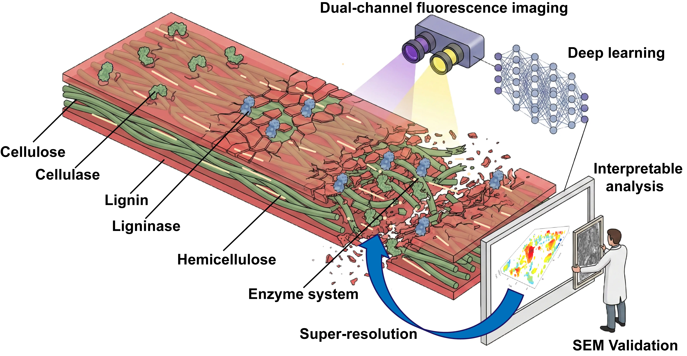
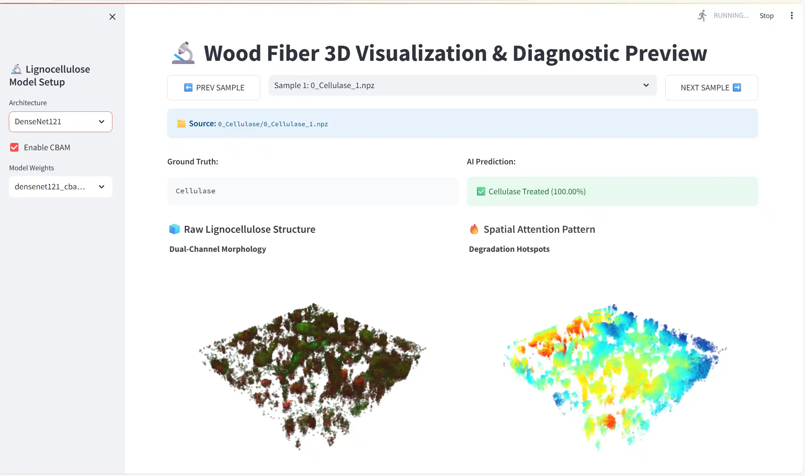

# Interpretable 3D Deep Learning for Multi-Enzyme Lignocellulose Deconstruction

[](https://fiber-xai.kanu.edu.kg/)
[]()
[]()

<p align="center">
  
</p>

This repository contains the official implementation of the study: **"Interpretable 3D deep learning identifies and reveals the spatial microstructure of multi-enzyme lignocellulose deconstruction"**. 

## 📖 Overview

Understanding the spatial mechanisms of multi-enzyme lignocellulose deconstruction has traditionally been hindered by the lack of spatially resolved and non-destructive analytical methods. This project establishes an interpretable three-dimensional (3D) deep learning framework integrated with a microfluidic platform. It is designed to decode the microstructural evolution of *Caragana korshinskii* biomass under varied enzyme treatments, including cellulase, lignin peroxidase, laccase, and their synergistic combinations.

Standardized 3D volumetric datasets were constructed using dual-channel confocal laser scanning microscopy (CLSM) and analyzed via 3D convolutional neural networks (CNNs) integrated with attention mechanisms. Explainable artificial intelligence (XAI) effectively reveals distinct spatial degradation signatures, distinguishing between surface-level fragmentation and deep internal hollowing.

## 🌐 Interactive XAI Web Interface

To facilitate interpretation and understand the model’s decision-making process, we developed a comprehensive web-based interface. It provides interactive visualization using interpretability techniques such as Grad-CAM and CBAM. 

**Access the live XAI tool here:** [https://fiber-xai.kanu.edu.kg/](https://fiber-xai.kanu.edu.kg/)

<p align="center">
  
</p>
*Preview of the XAI web application demonstrating 3D heatmaps and sliced views of spatial dynamics.*

## 📂 Repository Structure

```text
├── environment.yml             # Conda environment configuration
├── data_processing/            # Scripts for data handling
│   ├── data_loader.py          # Standardized 3D dataset loading
│   └── dataextand.py           # Data augmentation (rotation and cropping)
├── gitpage_pic/                # Images for README and documentation
│   ├── 1.webp                  # Graphical Abstract
│   └── 2.webp                  # Web XAI Preview
├── models/                     # 3D Deep Learning Architectures
│   ├── densenet3d.py           # 3D DenseNet implementations (including DenseNet121-CBAM)
│   ├── resnet3d.py             # 3D ResNet variants (ResNet18, ResNet50)
│   ├── vit3d.py                # 3D Vision Transformer (ViT)
│   └── vit3d_light.py
├── train/                      # Training and evaluation modules
│   ├── dataset.py
│   ├── evaluate.py
│   └── train.py                # Main training loop with early stopping & LR scheduler
├── training_checkpoints/       # Saved model weights (.pth) and training logs
├── visualization/              # Scripts for generating scientific plots
│   ├── Laser_spectroscopy/     # CLSM spectral data visualization
│   ├── Model_training/         # Performance metrics, loss curves, and seaborn plots
│   └── t-SNE/                  # t-SNE clustering analysis for feature discrimination
└── web_xai/                    # Source code for the interactive Streamlit/Gradio web application
    ├── xai_v1.0.py ... xai_v3.1.py
⚙️ Installation & Setup
All experiments and model training were conducted in an environment configured with Python 3.10, PyTorch 2.1.2, and CUDA 12.8.

Clone the repository:

Bash
git clone [https://github.com/yourusername/lignocellulose-3d-xai.git](https://github.com/yourusername/lignocellulose-3d-xai.git)
cd lignocellulose-3d-xai
Create the Conda environment:
Use the provided environment.yml to install all necessary dependencies.

Bash
conda env create -f environment.yml
conda activate <your_env_name>
🚀 Usage
1. Data Processing
Raw .lif confocal imaging files should be converted into 2×512×512×64 npz format. Use the data_processing scripts to apply spatial cropping and rotation, yielding the final model inputs of 2×256×256×64 npz.

2. Model Training
To train the optimal DenseNet121-CBAM model:

Bash
python train/train.py --model densenet121_cbam --epochs 50 --batch_size 8
Training logs, validation metrics, and the best .pth weights will be saved automatically in the training_checkpoints/ directory.

3. Visualization and Interpretability
Generate scientific plots (e.g., performance comparison, t-SNE) using the scripts in the visualization/ folder:

Bash
python visualization/t-SNE/generate_tsne.py
To run the XAI web interface locally:

Bash
python web_xai/xai_v3.1.py
🏆 Model Performance
Our study evaluated several modern architectures. The DenseNet121-CBAM architecture achieved the optimal balance between predictive performance and generalization. It circumvents traditional "black-box" limitations by integrating channel and spatial attention mechanisms (CBAM), revealing underlying mechanisms of multi-enzyme synergy.